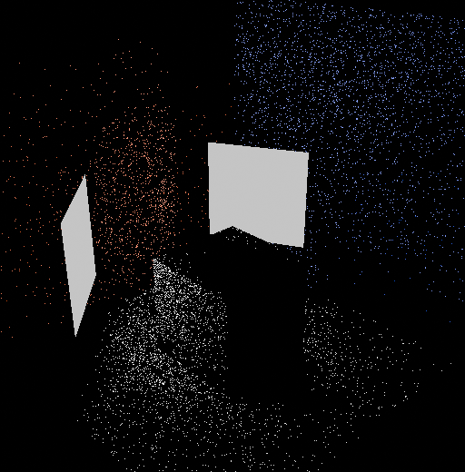
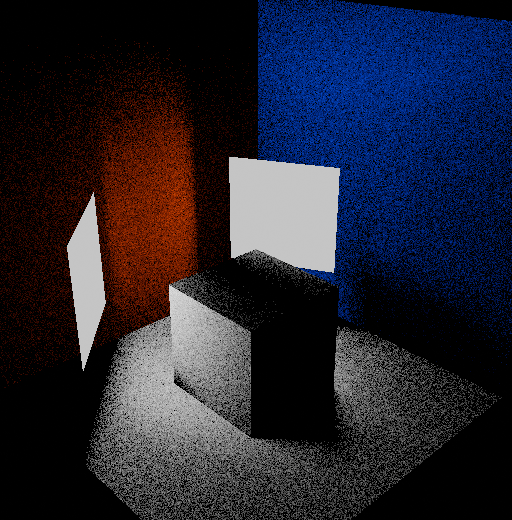
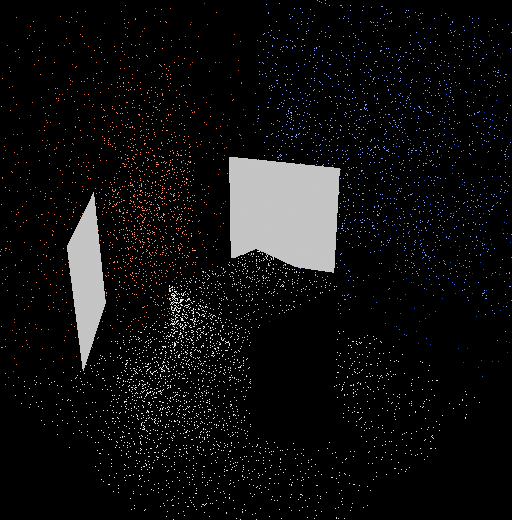
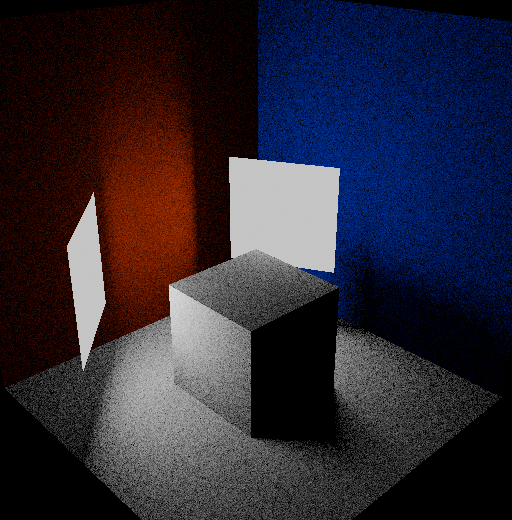
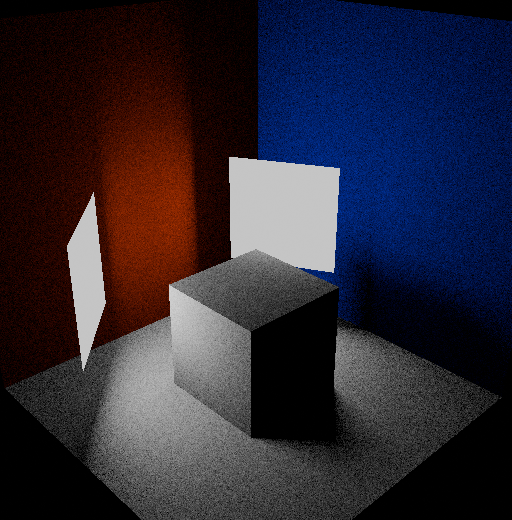
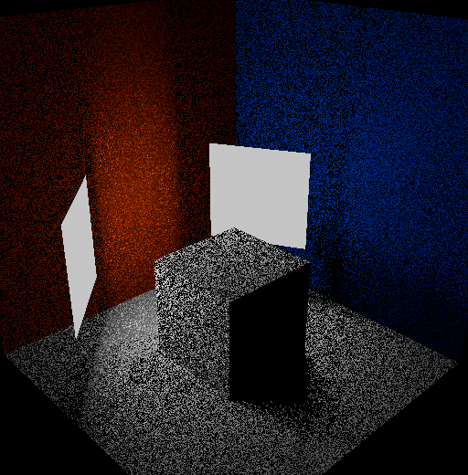
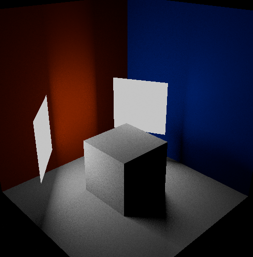
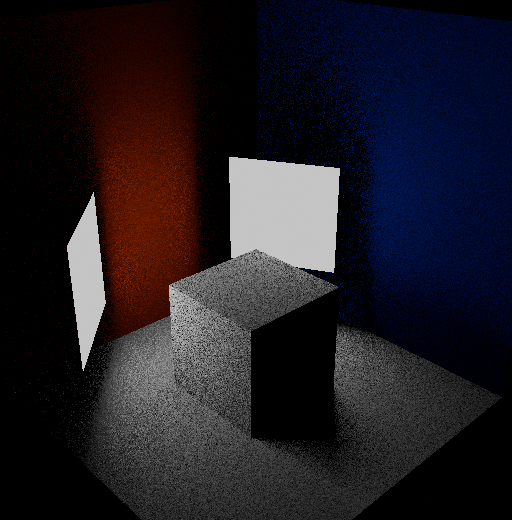
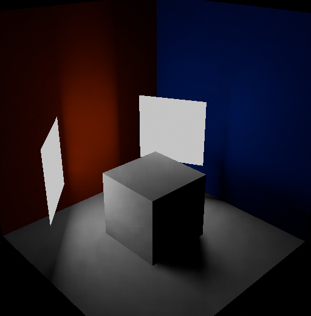

# ALFie
Area Light Framework for study

This is a personal study of different methods of handling area lights.

To skip steps (loading scene, creating renderer, etc.) I've hacked together a simple custom Blender renderer in Python, which, while slower, allowed me to play around with different methods without the side-hustle of creating the base framework.

A simplified rendering equation for direct lighting with Lambertian BRDF is solved via Monte Carlo. A few methods of sampling have been used.

You can see the full results here: [Download the full report](./Results.pdf)

## Direct Sampling - Uniform Sampling
Rays are sent from every pixel following a solid angle uniform sampling, and when they hit an area light, the light contribution is considered.

<table>
  <tr>
    <td></td>
    <td></td>
    <td></td>
    <td></td>
  </tr>
  <tr>
    <td colspan="4" align="center">
      <b>Figure 1: Uniform sampling results across 1, 50, 128 and 256 rays per pixel</b>
    </td>
  </tr>
</table>
[!NOTE]
The top face of the cube is not lit correctly because when I generated the screenshots I've, wrongly, used the potato uniform sampler with the right solid angle PDF. Sorry, me potato.
## Direct Sampling - Cosine sampling
Rays are distributed via a cosine PDF which, in combination with Lambertian BRDF, results in a much simpler implementation as the BRDF cancels out.

<table>
  <tr>
    <td></td>
    <td></td>
    <td></td>
    <td></td>
  </tr>
  <tr>
    <td colspan="4" align="center">
      <b>Figure 2: Cosine sampling results across 1, 50, 128 and 256 rays per pixel</b>
    </td>
  </tr>
</table>

## Direct Sampling - Area lights importance
Rays are distributed towards area lights via an area light weight. The PDF is computed accordingly.

<table>
  <tr>
    <td></td>
    <td></td>
    <td></td>
    <td></td>
  </tr>
  <tr>
    <td colspan="4" align="center">
      <b>Figure 3: Area lights importance sampling results across 1, 50, 128 and 256 rays per pixel</b>
    </td>
  </tr>
</table>

## Direct Sampling - MIS
Cosine sampling and area lights importance sampling are combined together via MIS (Multiple Importance Sampling), where the 2 PDFs are sampled for each sample and combined.

Since area lights sampling is the workhorse, the cosine sampling contribution is marginal, resulting in little improvement over vanilla area lights sampling.

<table>
  <tr>
    <td></td>
    <td></td>
    <td></td>
    <td></td>
  </tr>
  <tr>
    <td colspan="4" align="center">
      <b>Figure 4: MIS sampling results across 1, 50, 128 and 256 rays per pixel</b>
    </td>
  </tr>
</table>

## Resampling Sampling - ReSTIR lite - 1 Ray per Pixel
I've studied ReSTIR with 1 ray per pixel sampled via area importance sampling. To test different aspects of it, I've implemented a version where the pixel reservoir contains the entire temporal historical data. This is different from pure ReSTIR, where the reservoir is collapsed and only the champion sample is kept along with radiance and other data. With all the temporal samples present in the reservoir, I could test the visual impact of recomputing PDF and cos(theta) when merging a spatial sample. The difference was not noticeable.

When merging spatial samples, to maintain 1 ray per pixel, the visibility of the sample was re-used and not recomputed.

Even with this naive implementation, merging temporal and spatial samples with only 1 new ray per pixel for the current frame sample gives amazing results.

<table>
  <tr>
    <td></td>
    <td></td>
    <td></td>
  </tr>
  <tr>
    <td colspan="4" align="center">
      <b>Figure 5: ReSTIR sampling merging 8 temporal samples with 0x0 spatial kernel, 7x7 spatial kernel, and 15x15 spatial kernel</b>
    </td>
  </tr>
</table>

Randomly dropping spatial samples improves performance, removes radiance spots, and adds noise, for which a denoiser can be used to achieve smooth results.

<table>
  <tr>
    <td></td>
    <td></td>
    <td></td>
    <td></td>
  </tr>
  <tr>
    <td colspan="4" align="center">
      <b>Figure 6: ReSTIR spatial sample drops: 0%, 25%, 50%, 90%</b>
    </td>
  </tr>
</table>

<table>
  <tr>
    <td></td>
    <td></td>
  </tr>
  <tr>
    <td colspan="4" align="center">
      <b>Figure 7: Left: ReSTIR collapsed, Right: ReSTIR historical with recomputation of PDF and cos(theta)</b>
    </td>
  </tr>
</table>
