# ALFie
Area Light Framework !WIP!

<table align="center" width="100%">
  <tr>
    <td width="20%"></td>
    <td align="center" width="60%">
      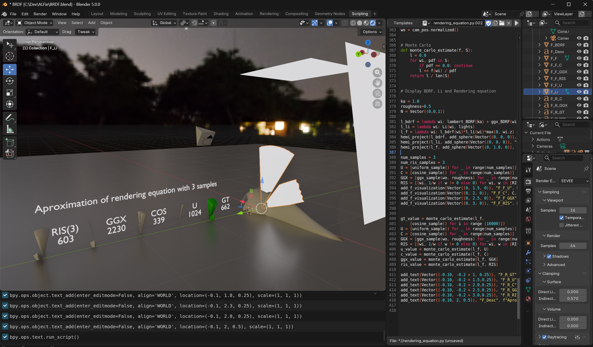
    </td>
    <td width="20%"></td>
  </tr>
</table>

This is a personal study of different methods of handling area lights.

To skip steps (loading scene, creating renderer, etc.) I've hacked a simple custom Blender renderer in Python, which, while slower, allowed me to play around with different methods without the side-hustle of creating the base framework.

The goal was to test ReSTIR and here's the result:

<table align="center" width="100%">
  <tr>
    <td width="20%"></td>
    <td align="center" width="60%">
      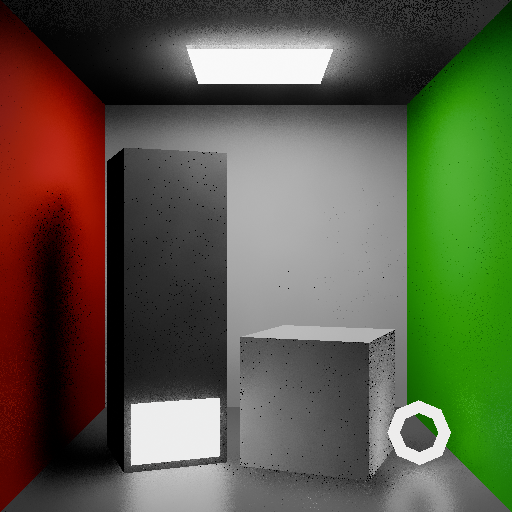
    </td>
    <td width="20%"></td>
  </tr>
  <tr>
    <td colspan="4" align="center">
      <b>ReSTIR DI. BRDF Lambert + GGX, 5 MIS samples (Area Lights & GGX), spatial re-use of 12 samples, 4 frames temporal accumulation. 0.86 rays per pixel (average). Denoise is missing & PDF is not recomputed - WIP</b>
    </td>
  </tr>
</table>

To improve shadow and specular quality during spatial phase analytical and neural joining methods have been considered.

<table>
  <tr>
    <td></td>
    <td></td>
    <td></td>
  </tr>
  <tr>
    <td colspan="4" align="center">
      <b>Figure 2: ReSTIR 1st spatial join of 10 reservoirs (from 64 MIS), radius 10. Left: All reservoirs joined. Middle: Analytic join based on pos's dist<0.1, nor's cos>0.9, half's cos>0.9. Right: Neural join with 11x64x64x1 MLP 4,993 parameters.</b>
    </td>
  </tr>
</table>

Both the analytical and the neural method will forward output sharp specular in the reservoir re-using pipeline. No denoiser was used.

You can see the full results here: [Download the full report](./Results.pdf)

Playground of ingredients: [Ingredients](./Alfie.pdf)

### Futuristic mumble
Dare to dream about an universe where MIS(Area, GGX) is uniform as lighting would be solved. All shaders would be replaced by a single warp.

## Direct Sampling - Uniform Sampling
Rays are sent from every pixel following a solid angle uniform sampling, and when they hit an area light, the light contribution is considered.

<table>
  <tr>
    <td>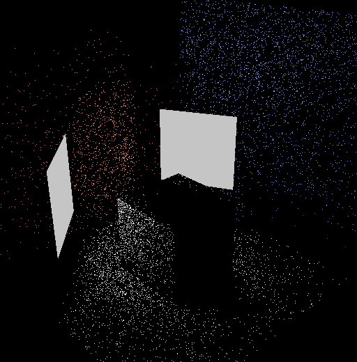</td>
    <td>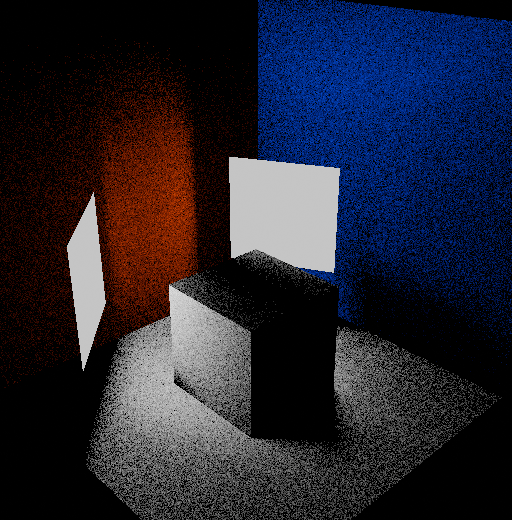</td>
    <td></td>
    <td></td>
  </tr>
  <tr>
    <td colspan="4" align="center">
      <b>Figure 3: (Potato) Uniform sampling results across 1, 50, 128 and 256 rays per pixel</b>
    </td>
  </tr>
</table>
[!NOTE]
The top face of the cube is not properly lit because when I've generated the screenshots I've wrongly used a potato uniform sampler with the right solid angle PDF. Sorry, me potato please forgive.

## Direct Sampling - Cosine sampling
Rays are distributed via a cosine PDF which, in combination with Lambertian BRDF, results in a much simpler implementation as the BRDF cancels out.

<table>
  <tr>
    <td>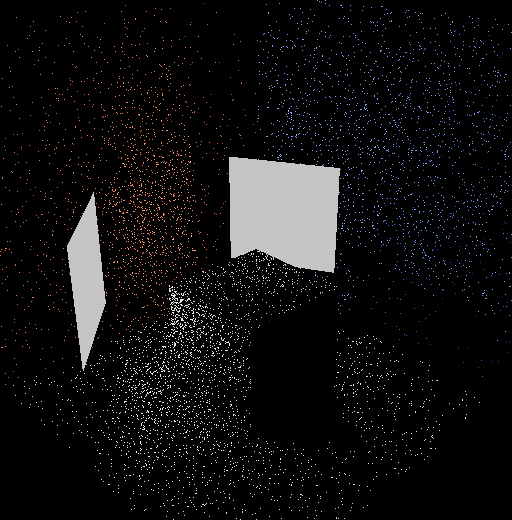</td>
    <td></td>
    <td>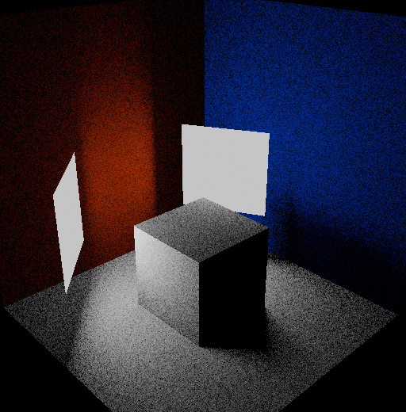</td>
    <td>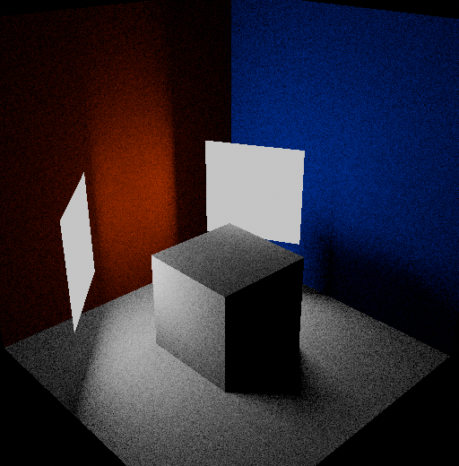</td>
  </tr>
  <tr>
    <td colspan="4" align="center">
      <b>Figure 4: Cosine sampling results across 1, 50, 128 and 256 rays per pixel</b>
    </td>
  </tr>
</table>

## Direct Sampling - Area lights importance
Rays are distributed towards area lights via an area light weight. The PDF is computed accordingly.

<table>
  <tr>
    <td>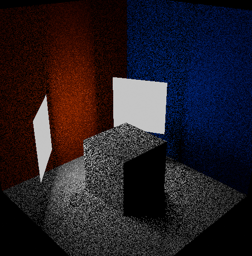</td>
    <td></td>
    <td>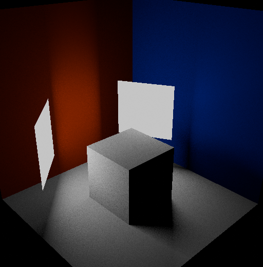</td>
    <td></td>
  </tr>
  <tr>
    <td colspan="4" align="center">
      <b>Figure 5: Area lights importance sampling results across 1, 50, 128 and 256 rays per pixel</b>
    </td>
  </tr>
</table>

## Direct Sampling - MIS
Cosine sampling and area lights importance sampling are combined together via MIS (Multiple Importance Sampling), where the 2 PDFs are sampled for each sample and combined.

Since area lights sampling is the workhorse, the cosine sampling contribution is marginal, resulting in little improvement over vanilla area lights sampling.

<table>
  <tr>
    <td></td>
    <td></td>
    <td></td>
    <td></td>
  </tr>
  <tr>
    <td colspan="4" align="center">
      <b>Figure 6: MIS sampling results across 1, 50, 128 and 256 rays per pixel</b>
    </td>
  </tr>
</table>

## Resampling Sampling - ReSTIR lite - 1 Ray per Pixel
I've studied ReSTIR with 1 ray per pixel sampled via area importance sampling. To test different aspects of it, I've implemented a version where the pixel reservoir contains the entire temporal historical data. This is different from pure ReSTIR, where the reservoir is collapsed and only the champion sample is kept along with radiance and other data. With all the temporal samples present in the reservoir, I could test the visual impact of recomputing PDF and cos(theta) when merging a spatial sample. The difference was minimal.

When merging spatial samples, to maintain 1 ray per pixel, the visibility of the sample was re-used and not recomputed.

Even with this potato implementation, merging temporal and spatial samples with only 1 new ray per pixel in the reservoir, ReSTIR-lite gives amazing results.

<table>
  <tr>
    <td>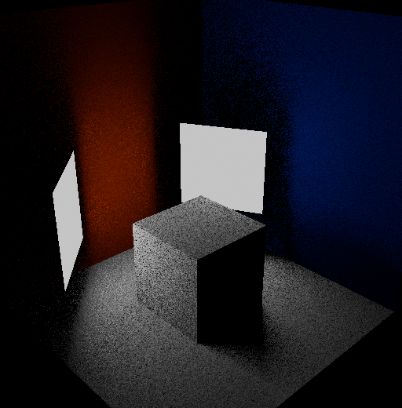</td>
    <td>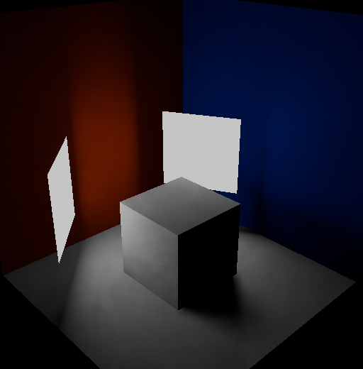</td>
    <td></td>
  </tr>
  <tr>
    <td colspan="4" align="center">
      <b>Figure 7: ReSTIR sampling merging 8 temporal samples with 0x0 spatial kernel, 7x7 spatial kernel, and 15x15 spatial kernel</b>
    </td>
  </tr>
</table>

Russian Roullete for spatial merging improves performance, removes radiance spots, and adds noise, for which a denoiser can be used to achieve smooth results.

<table>
  <tr>
    <td></td>
    <td></td>
    <td></td>
    <td></td>
  </tr>
  <tr>
    <td colspan="4" align="center">
      <b>Figure 8: ReSTIR spatial sample drops: 0%, 25%, 50%, 90%</b>
    </td>
  </tr>
</table>

Reusing PDF and cos(theta)

<table>
  <tr>
    <td></td>
    <td></td>
  </tr>
  <tr>
    <td colspan="4" align="center">
      <b>Figure 9: Left: Re-using PDF and cos(theta), Right: Recomputation of PDF and cos(theta) for each historical sample</b>
    </td>
  </tr>
</table>

The main difference—subtle but noticeable—is that recomputing both the PDF and cos(theta) for each merged sample produces sharper light cutoffs on the floor near each area light. Without recomputation, a soft fading effect appears. While recomputing the PDF contributes to this change, the sharper gradient is primarily driven by the recomputation of cos(theta).

Temporal vs Spatial Resampling

<table>
  <tr>
    <td></td>
    <td></td>
  </tr>
  <tr>
    <td colspan="4" align="center">
      <b>Figure 10: Left: Temporal resampling only (50 samples), Right: Spatial resampling with visibilty recomputed (50 samples)</b>
    </td>
  </tr>
</table>

Temporal resampling kicks socks off and has many advantages over spatial sampling. Since it shares the exact BRDF, Li, [V] with the main pixel, the samples are already best fit for resampling.

